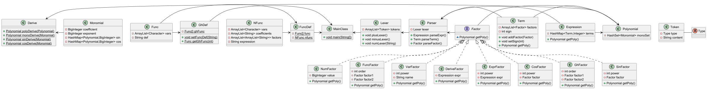
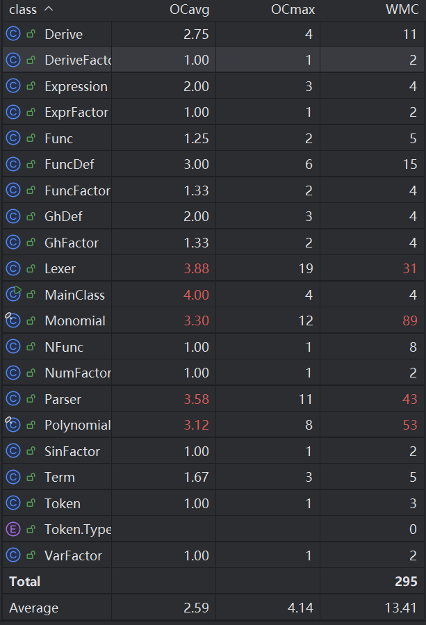
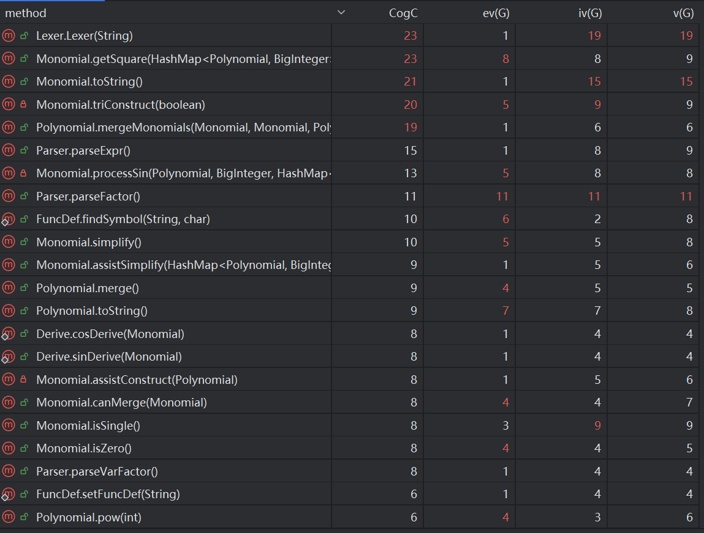
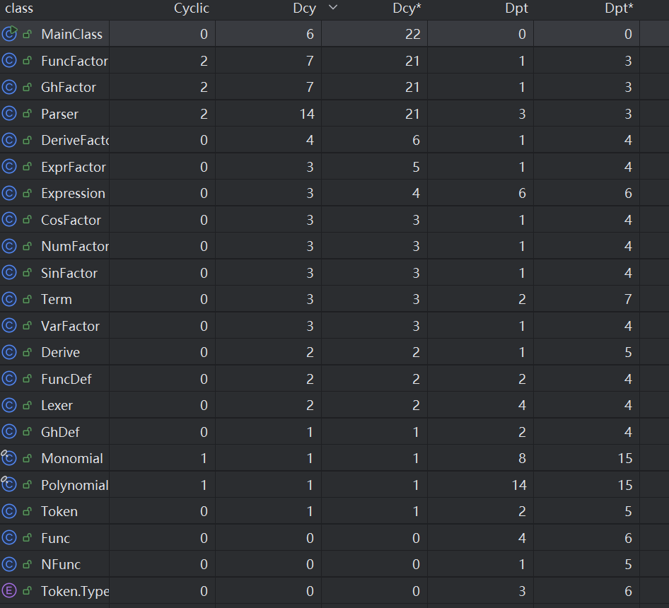

# 一、程序的结构与迭代 #

## 1、UML类图 ##



## 2、类说明 ##

| 名称 | 类型 | 功能 |
| :---: | :---: | :---:|
|$MainClass$|类|程序的入口|
|$Lexer$|类|词法分析|
|$Parser$|类|语法分析|
|$Token$|类|表达式预处理后的基本单位|
|$Polynomial$|类|多项式|
|$\textcolor{yellow}{Monomial}$|类|单项式|
|$\textcolor{yellow}{Derive}$|类|实现单项式和多项式的求导|
|$\textcolor{red}{Func}$|类|初始定义和普通函数|
|$\textcolor{red}{NFunc}$|类|递推定义|
|$\textcolor{red}{FuncDef}$|类|处理各递推函数|
|$\textcolor{yellow}{GhDef}$|类|处理各普通函数|
|$Expression$|类|表达式|
|$Term$|类|项|
|$Factor$|接口|因子|
|$NumFactor$|类|常数因子|
|$VarFactor$|类|幂函数|
|$ExprFactor$|类|表达式因子|
|$\textcolor{red}{SinFactor}$|类|三角函数因子|
|$\textcolor{red}{CosFactor}$|类|三角函数因子|
|$\textcolor{red}{FuncFactor}$|类|自定义递推函数调用|
|$\textcolor{yellow}{GhFactor}$|类|自定义普通函数调用|
|$\textcolor{yellow}{DeriveFactor}$|类|求导因子|

* 红色标记的类为第二次作业中新增，黄色标记的类为第三次作业中新增
* <code>Polynomial</code>类在第二次作业中进行了完全的重构，具体分析见下文**作业迭代**

## 3、复杂度分析 ##

### 类复杂度分析 ###



由该图可以很清楚地发现<code>Lexer</code>、<code>Parser</code>、<code>Monomial</code>、<code>Polynomial</code>类的加权方法复杂度最高，平均复杂度和最高复杂度也名列前茅，而这四个类也基本就是代码行数最多的几个类。<code>Lexer</code>类127行，<code>Parser</code>类255行，<code>Polynomial</code>类291行，而<code>Monomial</code>类更是达到了471行，差点就超过了500行的限制。事实上，在第三次作业，我原本是把求导运算交给了<code>Polynomial</code>类和<code>Monomial</code>类自己来实现，但是<code>Monomial</code>类最后达到了五百多行，超过了课程组代码风格的限制，所以我单独设计了<code>Derive</code>类来处理求导运算。

### 方法复杂度分析 ###



可以发现，最复杂的几个方法基本都是<code>Lexer</code>、<code>Parser</code>、<code>Monomial</code>、<code>Polynomial</code>类的方法。
- <code>Lexer</code>类构造方法的复杂度独占鳌头，而这个方法也只包含一个while循环，循环内部是一个超多分支的if语句，基本上对每一个表达式的符号都设置了一个if分支，现在看来可以将相同类型的操作符进一步合并以减少重复的代码和分支数。
- <code>Monomial</code>类的<code>getSquare</code>方法用于获取sin(x)^2*f(x)和cos(x)^2*f(x)类型的项，所以判断也比较复杂，而<code>toString</code>和<code>triConstruct</code>方法其实都是为了实现一个功能——<code>Monomial</code>类的字符串输出，后者是为了输出三角函数。
- 剩下的较复杂的<code>Monomial</code>和<code>Polynomial</code>类的方法都是为了实现化简功能，如二倍角化简、sin与cos内部正负号化简等，实现逻辑复杂，所以复杂度也不低。

## 4、依赖分析 ##



## 5、作业迭代 ##

### 第一次作业 ###

第一次作业的基本思路基本与上学期OOPre课程的第七次作业相同，我也基本仿照那次作业的框架进行搭建。
- 先用<code>Lexer</code>类将表达式解析为一个个<code>Token</code>，本质上是对表达式进行预处理，将较为复杂的表达式转化为较简单且数量较少的基本元素，为之后传入<code>Parser</code>进行后续的语法分析打下基础；同时，在此处实现处理多个连续加减号的情况。并且在后续的迭代中，对<code>Lexer</code>类的修改局限在更多if分支的添加，除此之外没有更大程度的修改，体现了可扩展性的特点。
- <code>Parser</code>类采用**递归下降法**进行语法分析，根据作业提供的形式化表述将表达式看成若干项的加减，将项看成若干因子的相乘。由此设计了<code>parseExpr</code>、<code>parseTerm</code>、<code>parseFactor</code>等方法。在<code>parseFactor</code>方法中，我们根据当前的<code>Token</code>类型来判断是哪种因子。和<code>Lexer</code>类类似，<code>Parser</code>类在后续的迭代也具有良好的可扩展性，只需要增加几个方法并简单修改<code>parseFactor</code>方法即可。但是在第一次作业中，我并没有统一每个“parse”方法在处理完毕后当前“token”是落在末尾还是下一个的开始。使后续迭代遇到了一些bug，最后统一处理完毕后会落在下一个项或因子的开始。
- 除此之外我也保留了OOPre第七次作业对<code>Factor</code>接口的设计，同时为其添加了<code>getPoly</code>方法，~~或许改名为<code>toPoly</code>更贴切~~，规定所有因子必须实现这个接口，也该重写<code>getPoly</code>方法。虽然<code>Term</code>类和<code>Expression</code>类并未实现这个接口，但也实现了<code>getPoly</code>方法。

- 我这次作业唯一有别于OOPre课程的第七次作业的地方就是<code>Polynomial</code>类的设置。由于这一次的表达式只会是多项式，我们根据如下的公式：
  $$poly=\sum_{i=0}^na_i*x^i$$
- 为<code>Polynomial</code>类初始化了一个<code>Hashmap</code>
来存储求和的每一项，键为不会重复的指数，对应的值为相应的系数，即
```Java
    private HashMap<Integer, BigInteger> polynomial = new HashMap<>();
```
- 同时我没有实现构造函数，而使用<code>setPolynomial</code>方法去改变它自身的值：
```Java
    public void setPolynomial(HashMap<Integer, BigInteger> polynomial) {
        this.polynomial = polynomial;
    }
```
- 同时为其实现了加、减、取负、乘、乘方运算，同时因为浅拷贝的问题，我单独设计了一个<code>copy</code>方法用于返回自身的一个深拷贝。最后实现<code>toString</code>方法用于输出表达式。然而，由于上述没有构造函数、浅拷贝、乘方实现逻辑混乱等问题暗藏在水面之下，在之后第二次作业三角函数的引入之后，表达式更加复杂，重构迫在眉睫。

```Java
    // tem.mul与this.pow交替使用让代码的分析和改进更加困难
    // 浅拷贝与深拷贝混用
    public Polynomial pow(int power) {
        Polynomial tem = new Polynomial();

        if (power == 0) {
            tem.polynomial.put(0, BigInteger.ONE);
            this.polynomial = tem.polynomial;
        } else if (power == 1) {
            tem = this.copy();
        } else if (power == 2) {
            tem = this.copy();
            tem.mul(tem);
            this.polynomial = tem.polynomial;
        } else if (power > 2) {
            tem = this.copy();
            tem.mul(pow(power - 1));
            this.polynomial = tem.polynomial;
        }

        return tem;
    }
```

*注：本次作业代码量在500行左右*

### 第二次作业 ###

第二次作业新增了三角函数和自定义递推函数，我这次的主要工作也集中在这两者上。

- 新增<code>Monomial</code>类和完全重构<code>Polynomial</code>类。由于本次新增了三角函数，表达式无法使用单独的<code>Polynomial</code>类进行存储。所以我们新增了<code>Monomial</code>类，并规定：
$$poly=\sum_{i=0}^nmono_i$$
$$mono_i=a_i*x^i*\prod_{i=0}^nsin(poly_i)*\prod_{j=0}^mcos(poly_j)$$
```Java
    // Polynomial类
    private final HashSet<Monomial> monoSet;
```
```Java
    //Monomial类
    private final BigInteger coefficient;
    private final BigInteger exponent;
    private final HashMap<Polynomial, BigInteger> sin;
    private final HashMap<Polynomial, BigInteger> cos;
```
- 同时我在阅读学长的博客之后，将这两个类设置成类似于<code>String</code>类的**不可变对象**，并仿照<code>BigInteger</code>类构造这两个类，将他们变成一个不可变对象，构造方法也采用深拷贝。这样的好处就是我们不会错误地在运算过程中无意改变我们本不想改变地对象的值，并且不用担心错误地使用浅拷贝。
```Java
    //Polynomial类的构造函数
    public Polynomial() {
        this(new HashSet<>());
    }

    public Polynomial(HashSet<Monomial> monoSet) {
        this.monoSet = new HashSet<>(monoSet); // 深拷贝
    }
    //Monomial类的构造函数
    public Monomial() {
        this.coefficient = BigInteger.ONE;
        this.exponent = BigInteger.ZERO;
        this.sin = new HashMap<>();
        this.cos = new HashMap<>();
    }

    public Monomial(BigInteger coefficient, BigInteger exponent) {
        this.coefficient = coefficient;
        this.exponent = exponent;
        this.sin = new HashMap<>();
        this.cos = new HashMap<>();
    }

    public Monomial(HashMap<Polynomial, BigInteger> sin, HashMap<Polynomial, BigInteger> cos) {
        this.coefficient = BigInteger.ONE;
        this.exponent = BigInteger.ZERO;
        this.sin = new HashMap<>(sin);
        this.cos = new HashMap<>(cos);
    }

    public Monomial(BigInteger coefficient, BigInteger exponent,
        HashMap<Polynomial, BigInteger> sin, HashMap<Polynomial, BigInteger> cos) {
        this.coefficient = coefficient;
        this.exponent = exponent;
        this.sin = new HashMap<>(sin);
        this.cos = new HashMap<>(cos);
    }
```

```Java
    //仿照BigInteger的pow函数构造
    public Polynomial pow(int power) {
        if (power < 0) {
            throw new IllegalArgumentException("Power must be non-negative.");
        }
        if (power == 1) {
            return this;
        }

        //* 结果poly
        HashSet<Monomial> newMonoSet = new HashSet<>();
        newMonoSet.add(new Monomial());
        Polynomial result = new Polynomial(newMonoSet);
        //* 基数poly
        Polynomial base = this;

        if (power == 0) {
            return new Polynomial(newMonoSet);
        }

        int powerCopy = power;

        while (powerCopy != 0) {
            if ((powerCopy & 1) == 1) {
                result = result.mul(base);
            }
            base = base.mul(base);
            powerCopy >>>= 1;
        }

        return result;
    }
```
- 另外，在合并同类项的过程中，我们需要判断（引用）不同的<code>Monomial</code>或<code>Polynomial</code>是否（值）相同，由于我们用<code>HashSet</code>和<code>HashMap</code>存相应的项，所以我们要重写<code>hashCode</code>和<code>equals</code>方法以确保哈希表的正确使用。

```Java
    // 以Polynomial类为例
    @Override
    public boolean equals(Object o) {
        if (this == o) {
            return true;
        }
        if (o == null || getClass() != o.getClass()) {
            return false;
        }

        Polynomial that = (Polynomial) o;

        return monoSet.equals(that.monoSet);
    }

    @Override
    public int hashCode() {
        return Objects.hash(monoSet);
    }
```

- 递推函数的设计。对于递推函数，因为它本身也符合形式化表述，也可以使用递推下降的方法进行解析，
  但后来我发现函数表达式里的自变量被扩展为形参自变量，有“x”也有“y”，如果我想要套用已有的框架
  去解析函数表达式时，需要对整体框架进行较大的改变，更主要是很可能会导致更多的bug，所以我最后
  将预处理输入的函数初始定义和递推定义用字符串存储起来，忽视它们作为表达式的特征，在最后用
  <code>replace()</code>方法将里面的形参替换为实际参数。
- 所以我构造了两个类<code>Func</code>和<code>NFunc</code>来存储递推函数的定义。将计算
  f{2...5}和记录初始定义和递推定义的工作交给了一个新的类<code>FuncDef</code>。
```Java
    public class Func /*存储函数初始定义和f{2...5}的表达式*/{
        private final ArrayList<Character> vars;
        private final String def;
    }
```
```Java
    public class NFunc /*存储函数递推定义*/{
        private final ArrayList<Character> vars = new ArrayList<>();
        private final ArrayList<String> coefficients = new ArrayList<>();
        private final ArrayList<ArrayList<String>> factors = new ArrayList<>();
        private String expression;
    }
```
```Java
    public class FuncDef {
        private static final Func[] func = new Func[10]; //* 各个序号递推函数定义
        private static final NFunc nfunc = new NFunc();
        private static int pos;
        private static int sign;
        private static int end;
        private static String def;

        public static void setFuncDef(String input) {
            // 存储函数的定义
            // TODO
        }
        public static void deduceFuncDef() {
            // 推导f{2...5}的定义
            // TODO
        }
    }
```
- 在处理的过程中，因为我需要在<code>FuncFactor</code>类的<code>getPoly</code>方法时获取
  f{0...5}的定义，而初始的定义与推导和语法分析在我的架构是分开的两个独立部分，所以要获取定义
  需要将一个<code>FuncDef</code>的对象传入<code>Parser</code>类，在每次调用
  <code>parseFuncFactor</code>方法时传入这个对象。显然，这个需要额外传入的参数与整个<code>Parser</code>类
  格格不入，并且只在<code>parseFuncFactor</code>方法中发挥作用。所以我把<code>FuncDef</code>的
  所有变量与方法都设置为静态类型，让它们可以直接通过类名被调用，同时自定义递推函数定义只有一种，
  所以我们不需要担心存储混乱等问题。

- 此外在使用<code>replace</code>方法替换形参为实参时，需要考虑替换“x”，“y”的先后问题，对于
  $f(x,y)=x^2+y^3$，如果先将x替换为y，再将y替换为x，就变成了$f(x,y)=x^2+x^3$，不是我们
  期待的$f(x,y)=x^3+y^2$。这有些类似于写一个交换x和y的值的函数，我们需要引入一个第三方变量，
  先将x换成第三方变量，再将y换成x，最后将第三方变量换成y。
```Java
    expr = func.getDef().replace(String.valueOf(func.getVars(0)), "#")
                        .replace(String.valueOf(func.getVars(1)), string2)
                        .replace("#", string1);
```

*注：本次作业代码量在1000行左右*

### 第三次作业 ###

第三次作业新增了求导和自定义普通函数。后者与自定义递推函数类似，甚至更加简单，所以套用
之前的框架就可以轻松解决。

- 为了避免同一个类代码函数过多，我重新构造了一个<code>Derive</code>类来处理求导运算，
  主体为两个方法，一个是对多项式<code>Polynomial</code>类求导，一个是对单项式
  <code>Monomial</code>类求导。除此之外，我还用两个辅助函数帮助单项式的sin和cos求导，
  以降低单个方法的复杂度。但是，<code>sinDerive</code>和<code>cosDerive</code>重复度较高，
  不太符合面向对象的编程要求，如果要改进代码最好将sin与cos统一起来或者尝试构造一个三角函数
  类作为它们的父类，让代码更简洁，易于扩展。

```Java
    public class Derive {
        public static Polynomial polyDerive(Polynomial poly) {
            // TODO
        }
        public static Polynomial monoDerive(Monomial mono) {
            //TODO
        }
        public static Polynomial sinDerive(Monomial mono) {
            // TODO
        }
        public static Polynomial cosDerive(Monomial mono) {
            //TODO
        }
    }
```

- 为实现自定义普通函数，新增类<code>GhFactor</code>和<code>GhDef</code>，实现方法
  基本和类<code>FuncFactor</code>和<code>FuncDef</code>相同，此处不再赘述。

*注：本次作业代码量在200行左右*

### 未来可能需要的迭代 ###

- 新增对数函数、指数函数等常用函数。实现指数函数只需增加一个<code>expFactor</code>，为
  <code>Monomial</code>类新增一个<code>HashMap</code>来存储指数函数的指数和底数。

```Java
    //Monomial类
    private final HashMap<Polynomial, Polynomial> exp;
```

- 对数函数类似地进行构造即可，需要注意的是对数函数的定义域问题，最后可以在输出表达式处加入
  定义域输出。


# 二、代码bug分析 #

## 1、历次作业bug ##

### 第一次作业 ###

**互测强侧均未被发现bug**

### 第二次作业 ###

强测bug

- 读取递推函数定义时使用<code>def.indexof(')')</code>寻找结束的右括号，忽视了def
  为"$f\{n-1\}(x,sin(x))$"的情况。
- <code>Monomial</code>类的<code>toString</code>方法实现错误，在单项式只含$cos(0)$时
  输出空字符串而不是"1"。

互测bug

- 同强侧bug第一点。
- 在化简"$sin(x)^2+cos(x)^2+sin(1)^2+cos(1)^2$"时将两个合并的1放在<code>HashSet</code>
  中导致只输出一个1。

### 第三次作业 ###

强测bug

**未被发现bug**

互测bug

- 读取递推函数定义时使用<code>def.indexof(',')</code>寻找结束的逗号，忽视了def
  为"$f\{n-1\}(x,g(3,7))$"的情况，~~事不过三。~~
- 在化简"$4*sin(x)^2*cos(x)^2$"错误的处理$sin(2x)$里的因子和指数

## 2、评测机搭建 ##

在第一次作业中，一是本次作业并不复杂，二是对新事物的畏难心理，我并没有搭建评测机，值得庆幸的
顺利地通过了强侧和互测。第二次作业由于复杂度大幅提升，我重构了大量第一次作业的代码，也加入了
很多新的类，我就仿照往届[学长的博客](https://saltyfishyjk.github.io/2022/03/07/%E3%80%8CBUAA-OO-Unit-1-HW1%E3%80%8D%E9%9D%A2%E5%90%91%E6%B5%8B%E8%AF%95%E5%B0%8F%E7%99%BD%E7%9A%84%E7%AE%80%E6%98%93%E8%AF%84%E6%B5%8B%E6%9C%BA/)
搭建了自己的评测机，也对自己的代码自行测试，找到了一些bug和性能上的问题（具体分析见下文**代码运行性能优化**）。
但是，由于自定义递推函数实现其来比较复杂，我也就放弃了对其在评测机上的实现，相信自己的代码
在这方面不会出问题，结果不出意料地在强测中折戟沉沙，进入了C组。在第三次作业，我尝试实现了题目要求的所有功能，跑出了我代码的几个严重bug，顺利通过了强测。在几次作业的迭代和互测过程中，我对评测及的搭建有几点感想：

- 评测机的覆盖率很关键，如果不控制数据生成，而采用完全随机，很容易漏掉一些特殊的样例。处
  理的手段可以是加入人工针对性构造，也可以在评测机中加入**常量池**和**特殊数据**，在数据生成过程中调用这些值，以增加数据生成的覆盖率。
- 保证评测机的正确也是极其重要的，因为这次数据的对拍使用了Python的<code>Sympy</code>库，
  所以对拍结果的正确性无需太多质疑。而生成数据部分，可以通过和自己的程序对拍来验证正确性。
  如果评测机本身就搭错了，最后的结果也只能是南辕北辙，白费功夫。

## 3、hack策略 ##

- 使用自己搭建的评测机测试寻找bug，在第二次互测中大部分hack数据都是通过评测机生成出来的。把评测机挂在一旁跑，自己可以做点别的事，极大地提高了效率。
- 自己构造一些易出错的数据或自己犯过的错来进行检测，如$sin(0)^0$等，主要针对一些评测机不能较好覆盖到的情形。
- 阅读同学的代码，从具体的实现中寻找潜藏的bug。这种方法虽然还可以学习到别人的架构思路，但是在第二次作业之后，动辄十几个类、长达一千多行的代码要看下来还是需要一点耐心的。

# 三、输出表达式性能优化 #

## 1、单项式化简 ##

- $sin(0)^0$化为1，$sin(0)^i,i>=1$化为0，$cos(0)^i$化为1。对此加入if语句特判即可。
- 统一$sin(poly_1)^i*sin(-poly_1)^j*cos(poly_2)^m*cos(poly_2)^n$。也即将内部互为相反数的sin和cos统一。后续在强测性能分的获取中，我发现此处还可以加入特判，将$sin(-17)$和$sin(-x^2-34)$等转化为$-sin(17)$和$-sin(x^2+34)$，如果将内部取相反数会减少内部的长度即可以将负号提到外面，cos也可以有类似的操作。我只是将正负号统一，并没有进一步寻找更优的输出，导致强测一些数据的性能分较低。
```Java
    //sin(-x)sin(x)的化简
    Iterator<Map.Entry<Polynomial, BigInteger>> sinIterator = newSin.entrySet().iterator();
        while (sinIterator.hasNext()) {
            Map.Entry<Polynomial, BigInteger> sinEntry = sinIterator.next();
            Polynomial p = sinEntry.getKey();
            BigInteger sinValue = sinEntry.getValue();

            Polynomial negP = p.negate();
            if (newSin.containsKey(negP)) {
                BigInteger negSinValue = newSin.get(negP);

                reverse *= sinValue.testBit(0) ? -1 : 1;
                newSin.put(negP, sinValue.add(negSinValue));
                sinIterator.remove();
            }
        }
```

- 化简sin的二倍角。我们只需遍历sin和cos的<code>HashMap</code>寻找可以化简的部分即可。需要注意的是，只有$4*sin(x)^2*cos(x)^2$这种可以完全化简的表达式一定保证得到更简洁的形式，$2*sin(x)^2*cos(x)^2$化简为$sin(x)*cos(x)*sin*(2*x)$大概率会使形式更加臃肿，所以要加入相应的特判。
```Java
    // 二倍角公式处理sin的部分
    private BigInteger processSin(Polynomial p, BigInteger num,
        HashMap<Polynomial, BigInteger> newSin) {

        Iterator<Map.Entry<Polynomial, BigInteger>> sinIterator = newSin.entrySet().iterator();
        while (sinIterator.hasNext()) {
            Map.Entry<Polynomial, BigInteger> sinEntry = sinIterator.next();
            Polynomial q = sinEntry.getKey();
            BigInteger sinValue = sinEntry.getValue();
            Polynomial negP = p.negate();

            if ((p.equals(q) || negP.equals(q)) && !sinValue.equals(BigInteger.ZERO)) {
                if (num.equals(sinValue)
                    && num.compareTo(BigInteger.valueOf(Integer.MAX_VALUE)) < 0) {
                    if (coefficient.getLowestSetBit() >= num.intValue()) {
                        sinIterator.remove();
                        newSin.merge(q.mul(1), num, BigInteger::add);
                        return num;
                    }
                }
            }
        }
        return BigInteger.ZERO;
    }
```

## 2、多项式化简 ##

- 我在第二次作业中只实现了诸如$sin(x)^2+cos(x)^2=1$形式的化简，并没有进一步考虑cos的二倍角，三倍角，和角公式等情形。具体的实现思路是为<code>Monomial</code>类实现一个<code>canMerge</code>方法，来判断两个单项式之间是否可以化简。然后在<code>Polynomial</code>类遍历所有单项式，调用这个方法，如果可以合并则合并。

```Java
    public Polynomial canMerge(Monomial mono) {
        // 先判断系数和幂函数是否相同
        if (!mono.getCoefficient().equals(coefficient) ||
            !mono.getExponent().equals(exponent)) {
            return null;
        }

        HashMap<Polynomial, BigInteger> monoSin = mono.getSin();
        HashMap<Polynomial, BigInteger> monoCos = mono.getCos();

        // 判断是否只差一个sin(poly1)^2
        // getSquare是辅助方法，寻找sin(poly1)^2项
        Polynomial getSinPoly;
        if (monoSin.isEmpty()) {
            getSinPoly = getSquare(monoSin, sin);
        } else {
            getSinPoly = getSquare(sin, monoSin);
        }

        if (getSinPoly == null) {
            return null;
        }

        // 判断是否只差一个cos(poly2)^2
        // getSquare是辅助方法，寻找cos(poly2)^2项
        Polynomial getCosPoly;
        if (monoCos.isEmpty()) {
            getCosPoly = getSquare(monoCos, cos);
        } else {
            getCosPoly = getSquare(cos, monoCos);
        }

        // 判断poly1是否等于poly2
        if (!getSinPoly.equals(getCosPoly)) {
            return null;
        }

        // 返回要合并的部分
        return getSinPoly;
    }
```

# 四、代码运行性能优化 #

在第二次作业搭建评测机之后，我便用它来测试我写的代码。在排除掉一些设计bug之后，我发现我的代码在处理一些数据的过程中会运行超时。而我室友的程序基本都是秒出结果。所以我使用IDEA的JProfiler插件来测试我的代码，发现了几个问题：
- 在<code>Polynomial</code>类的加减乘等运算中多次调用较复杂的<code>simplify</code>方法（用于化简多项式）。
- <code>Polynomial</code>类和<code>Monomial</code>类的对象需要大量计算其本身的hash值，而计算较为复杂，占用太多时间，解决方法就是缓存哈希值（不可变对象的又一个好处）。
```Java
    public final class Monomial {
        private boolean isHash = false;
        private int cachedHashCode; // 缓存哈希码

        @Override
        public int hashCode() {
            if (!isHash) {
                cachedHashCode = Objects.hash(coefficient, exponent, sin, cos);
                isHash = true;
            }
            return cachedHashCode;
        }
    }
```
- <code>Polynomial</code>类的加法和乘法方法运行速率慢，又大量调用。我并没有找到减少调用的方法，所以我选择采用**并行化**来计算加法和乘法，一次来提升性能。
```Java
    public Polynomial mul(Polynomial poly) {
        // 并行化
        return this.monoSet.parallelStream()
                .map(mono -> mono.mulPoly(poly))
                .reduce(new Polynomial(), Polynomial::add)
                .simplify();
    }
```

```Java
    //test 1
    0
 	- -	 	sin(			x 		 ^			0)	 		+	 	 -+417 	* (  +	  (	 +    	-438		 * +34 	+ 	-		( 	 	-	 	  +631 	*cos(	   -361) 	+  cos(		  +501			 )	*+792  * 		x++ 	(		-	(+657) 	  ^	   +1		  * 	  x	*	191	 		+x		*			 (419)	 ^8	 	 *	x	  *cos(  x	^6 	)  	+    -+21	   )	^4)^ 	+7	 *559    )^		+7* +958 * 	784	   -	  	-				sin(		 	x)^  +1	 	 *		 940	  *sin(  	-124	 )^+4 )^2		
    //test 2
    0
    ++846	*865 	  *	 sin( 	(-   -			sin((-2*x) 	)	 ^	 +4 		 *	cos(sin( 	 	(-2*x) 		) 	  )  		^			 +6   	+ 	+	(	 	 +   	sin( 			x	 	 ) 	*  cos(719  )*			(			( -  	-	  +910	*	  (-533)^	 4	  +			x ^	 	 +6	  * 	-4741655   	- 		x		*cos(			612 	 )	 *836 	 *	-470		+	+   	880 ) 	 ^	+8 *x		^				+4*	  x ^+8 			) 	  ) ^	 		5	 *431 		 *95   *  x  	+ 				x	  *x	 * 	x  *	cos( +127 	)  	)		  )  	^	   +1	- sin((-2*x)   )    ^    2 	      
```

# 五、LLM的使用 #

在三次编程作业的完成中，我多次使用了大语言模型来辅助我完成作业。特别是在第二次作业，无论是作业中一些细节的实现，还是一些表达式的优化和并行化运算优化性能，还有评测机的搭建过程，我都大量使用了大语言模型来帮助我生成代码或提供解决思路，在于AI的交流过程中，我自己的编程能力也有了逐步的提升，逻辑思维能力也得到了加强。但需要关注的是大语言模型有时候会一本正经地胡说八道，这就要求我们要有很好的鉴别能力，善于辨别信息的真伪。在纷乱繁杂、鱼龙混杂的网络世界，信息辨别能力也是我们计算机系学生不可或缺的一项能力。

# 六、心得体会 #

不得不说，OO这门课不愧是计算机系的**大国重器**，即使在难度已经很高的同辈课程之中也是独领风骚，在困难程度和任务量方面一枝独秀。在第一个月三次编程作业两次实验两次研讨的轰炸下，我每周二到周四忙着完成作业，周五周六搭评测机，周日周一放松一下，和同学玩“狼人杀”“谁是卧底”，每一周都有充实的生活。尤其是第二次作业，花了大量的时间完成作业，又花费不少的时间搭评测机，但又因为疏忽导致了严重bug，周一互测完，周二又老老实实修bug去了。幸亏现在操作系统这门课还没有完全露出獠牙，新开的机器学习还可以得过且过，不然真得一周168小时高强度工作了。

虽然过程如此艰辛，我也渐渐地在三次迭代作业中体会到面向对象的思想，渐渐摆脱之前学C语言被囚禁的思想，在互测过程中学习别人代码的优秀设计和实现思路，对问题的考虑也变得更加缜密。在学习过程中许多第一次的尝试，也让我逐渐走出舒适圈，对以前很多以为遥不可及、难以掌握的概念逐渐熟悉起来。也深刻地理解了为什么计算机行业更新换代飞快，只有不断学习才能不被淘汰。

虽然第二次作业强测结果不尽如人意，第三次作业还犯了几个和前一次作业类似的毛病，但希望我自己能带着这一单元的收获，在下一单元的学习中加以应用，迈向更高的平台。

# 七、未来方向 #

- 或许可以提供一些样例来进一步解释互测的cost说明。
- 希望三次作业难度可以更有梯度一点，第二次作业相比第一次作业难度大幅上升，而第三次作业甚至比第一次作业还要轻松，一两个小时就能完成。
- 最后一次作业强测强度不高（？），强测没被发现bug，互测被找到几个比较严重的bug，或许可以增加到四十甚至一百个数据，毕竟之后没有迭代任务了。